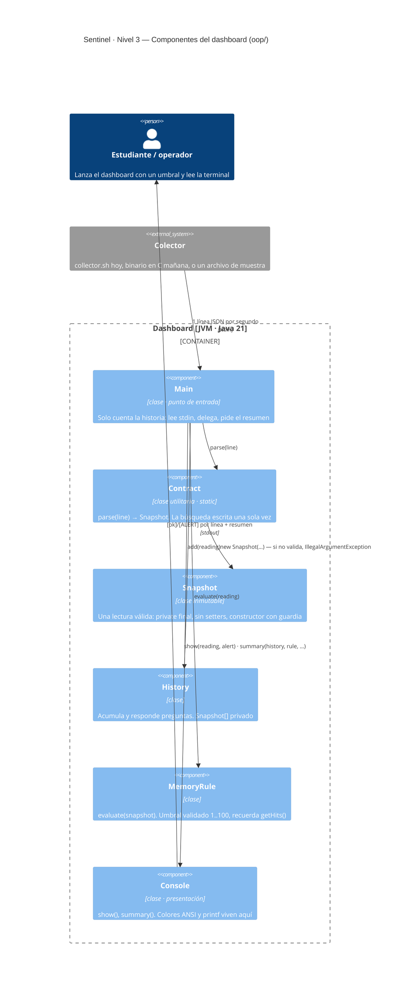

# Sentinel — Fase 2: Java, antes y después de la POO

El mismo dashboard, escrito dos veces. **Misma entrada, misma salida, mismo resumen.** Lo único que cambia es *quién sabe qué* dentro del programa.

| Carpeta | Qué es | Marcas en el código |
|---------|--------|---------------------|
| [`procedural/`](procedural/) | Un archivo, un `main`, 18 variables sueltas. Funciona. Es como lo escribiría alguien que sale de Programación I. | `PAIN 1` … `PAIN 6` |
| [`oop/`](oop/) | Seis clases, cada una dueña de una cosa. Mismo comportamiento. | `ABSTRACTION` · `ENCAPSULATION` |

Ambos consumen el contrato de la Fase 1 por stdin: no saben si la línea viene de `collector.sh`, de un archivo o, más adelante, de un binario en C.

## Qué hace el dashboard

Por cada línea del contrato imprime `[ok]` o `[ALERT]` (como `alert.sh`, pero en Java) y, cuando el stream termina, un resumen:

```
Sentinel (oop) · memory threshold: 80%
[  ok  ] 11:00:06  mem  75%  cpu  61.9%  load 1.45  procs 318  top stress-ng
[ALERT ] 11:00:07  mem  87%  cpu  78.2%  load 1.98  procs 319  top stress-ng
...
── Summary ─────────────────────────────────────
lines read: 20  valid: 20  invalid: 0
memory average: 50%  max: 90% at 11:00:08
max load: 2.40
most frequent process: firefox (9 times)
alerts: 3
```

## Cómo correr

Las muestras viven en [`../phase1-bash/samples/`](../phase1-bash/samples/) y sirven para trabajar **sin** colector vivo (y sin Linux).

**Procedural** — un solo archivo; el JDK lo ejecuta sin paso de compilación:

```bash
cd sentinel/phase2-java/procedural
java Sentinel.java 80 < ../../phase1-bash/samples/muestra-2026-09-17.txt
../../phase1-bash/collector.sh | head -20 | java Sentinel.java 50
```

**OOP** — varios archivos; se compila primero:

```bash
cd sentinel/phase2-java/oop
javac -d out *.java
java -cp out Main 80 < ../../phase1-bash/samples/muestra-2026-09-17.txt
../../phase1-bash/collector.sh | head -20 | java -cp out Main 50
```

El `head -20` no es decorativo: el resumen se imprime cuando stdin **termina**, y `Ctrl+C` mata a los dos programas del pipe antes de eso.

## La prueba de la fase

Como en el paso Bash → C del proyecto, la reescritura no cambia el comportamiento. Se verifica con las herramientas de la Fase 1:

```bash
java procedural/Sentinel.java 80 < ../phase1-bash/samples/muestra-2026-09-17.txt > /tmp/a.txt
java -cp oop/out Main 80        < ../phase1-bash/samples/muestra-2026-09-17.txt > /tmp/b.txt
diff /tmp/a.txt /tmp/b.txt      # solo difiere la primera línea (el encabezado)
```

Y la prueba que separa a las dos versiones — datos que **rompen** el contrato:

```bash
java procedural/Sentinel.java 80 < ../phase1-bash/samples/muestra-rota.txt   # miente y luego muere
java -cp oop/out Main 80        < ../phase1-bash/samples/muestra-rota.txt   # rechaza 4 líneas, termina bien
```

## Mapa: cada dolor y la clase que lo cura

| Dolor (en `procedural/Sentinel.java`) | Qué pasa | Cura (en `oop/`) | Pilar |
|---|---|---|---|
| **PAIN 1** — `threshold` es un `int` cualquiera | `java Sentinel.java 300` corre feliz y nunca alerta | `MemoryRule` valida 1..100 en el constructor | Encapsulamiento |
| **PAIN 2** — 18 variables sueltas en `main` | Cualquier línea puede pisar cualquier variable | `Snapshot` (una lectura) e `History` (los acumuladores) con campos `private` | Encapsulamiento |
| **PAIN 3** — siete bloques `indexOf`/`substring` con números mágicos | Un campo nuevo en el contrato toca 5 lugares y rompe un sexto | `Contract.parse()`: la búsqueda escrita una vez, en `raw()` | Abstracción |
| **PAIN 4** — nadie valida `memTotalKb` ni `memUsedKb` | `muestra-rota.txt`: imprime `1045092%`, luego `107%`, luego muere por división por cero | El constructor de `Snapshot` rechaza el dato: el estado inválido no puede existir | Encapsulamiento |
| **PAIN 5** — la contabilidad del resumen mezclada con leer e imprimir | Tres trabajos en el mismo bloque; arreglos paralelos `names[]`/`times[]` | `History` acumula y responde preguntas; `Main` solo pregunta | Abstracción |
| **PAIN 6** — formatear la hora, copiado dos veces | Cambiar el formato = acordarse de dos lugares | `Snapshot.getTime()`, una sola vez | Abstracción |

## Arquitectura (modelo C4)

El diagrama completo, con los tres niveles (contexto, contenedores, componentes), está en [Apuntes/Clase06-C4.excalidraw](../../Apuntes/Clase06-C4.excalidraw). Este es el nivel 3, los componentes del dashboard:



## Lo que NO hay aquí todavía (a propósito)

- **Sin paquetes**: los seis archivos van en una carpeta. Los `package` llegan cuando el proyecto crezca.
- **Sin herencia ni interfaces**: `Console` y `MemoryRule` piden a gritos ser una familia de renderers y de reglas. Eso es la Unidad 3; hoy basta con que vivan separadas.
- **Sin `ArrayList`**: `History` usa un arreglo con capacidad fija. Las colecciones llegan en la clase 8, y cuando lleguen, `History` cambia por dentro y `Main` no se entera. Esa es la demostración de abstracción que más vale la pena.

## Guías de clase

- [Clase 5 — Del script al programa: Java procedural y sus dolores](../../Apuntes/Clase05-Guia.md)
- [Clase 6 — Abstracción y encapsulamiento: el mismo programa, con dueños](../../Apuntes/Clase06-Guia.md)
